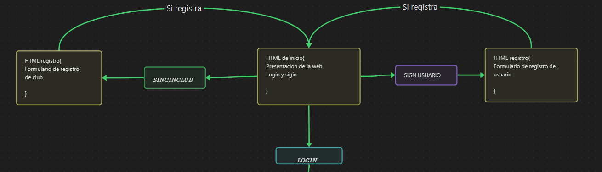

# Hoop manager

Hoop manager es una plataforma para gestionar clubes de baloncesto amateur, permitiendo registrar jugadores, equipos, gestionar calendarios y registrar resultados.

## Lenguajes usados

-HTML
-CSS
-JAVASCRIPT

## Características

### Registro de usuarios

- Admin
- Club (sera la cuenta para la persona que sea el responsable del club)
- Entrenador
- Jugador
- Familiares

### Gestion de club (solo para el responsable del club)

- Establecer roles
- Dar de alta/baja usuarios
- Establecer/modificar calendarios
- Borrar usuarios
- Enviar mensajes generales

### Gestion de equipo (para entrenadores)

- Convocatorias
- Dar de alta/baja jugadores
- Gestion de estadisticas
- Gestion de calendario
- Enviar mensaje general para su equipo
- Enviar mensaje a familiar de un jugador
- Enviar mensaje a un jugador
- Visualizacion de fichas de jugadores

### Visualizacion de jugadores

- Ver antigüedad en el club
- Ver estadisticas personales
- Ver informacion personal

## Diagrama

## Autor

- [[David Galindo](https://github.com/davidglnd)]
- Proyecto neoland
